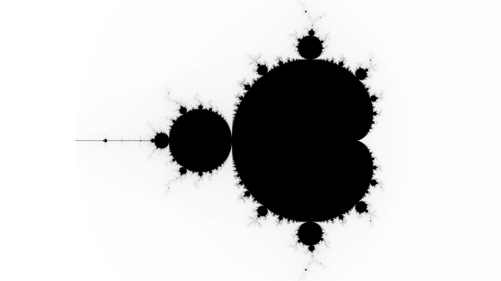
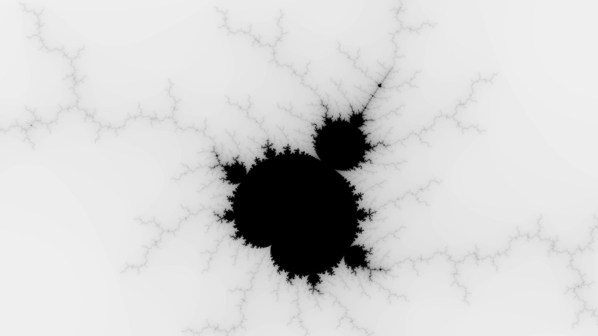

## Mandelbrot set drawer in Go
This is a practise exercise to learn Go

### Results
Here are a couple images generated by this project

Image centered at -0.6, width is 3 and height is 2:

Image centered at -0.9 + 0.25i, width is 0.1875 and height is 0.125:

Image centered at -1.256 + 0.382i, width is 0.1875 and heigh is 0.125:

### Upcoming
Currently the biggest performance bottleneck is writing to disk. To fix this, it would be wise to use a more efficient file storage format.