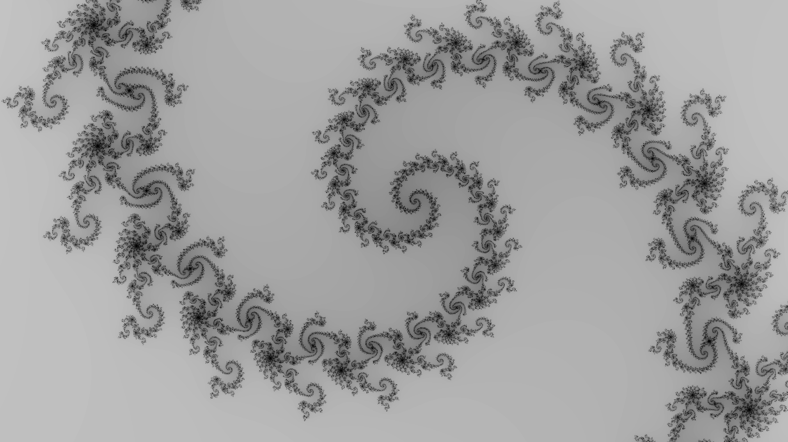

## Mandelbrot set drawer in Go
This is a practise exercise to learn Go. It draws the mandelbrot set.

### The math
The [mandelbrot set](https://en.wikipedia.org/wiki/Mandelbrot_set) is a mathematical object defined as all complex points `c`, such that:
- Starting with `z = 0`
- Repeteadly applying the transformation `f: z → z*z + c`, the norm does not diverge to infinty.

It is known that if `|z| > 2`, then the value diverges, hence we can color the complex plane according to how many iterations it takes to reach `|z| = 2`. To be certain that a particular point does not diverge, we'd have to iterate at infinitum, hence an upper bound must be set (in the latter images, `max_iter = 1000`). This upper bound controls the accuracy (higher is better) and computational expense (lower is cheaper).

In these images, lighter colors represent faster divergence times (i.e. fewest iterations before exiting the threshold), and pure black represents that the maximum number of iterations has been reached.

### Work in progress
- [ ] Currently the biggest performance bottleneck is writing to disk. To fix this, it would be wise to use a more efficient file storage format.
- [ ] Too many hardcoded variables. Ideally they are passed as command-line arguments
- [ ] Too dull, I should find a more colorful colormap.

### Results
Here are a couple images generated by this project

Image centered at -0.6, width is 3 and height is 2:

Image centered at -0.9 + 0.25i, width is 0.1875 and height is 0.125:

Image centered at -1.256 + 0.382i, width is 0.1875 and height is 0.125:

Image centered at -0.8033 + 0.178i, width is 0.001778 and height is 0.001:

