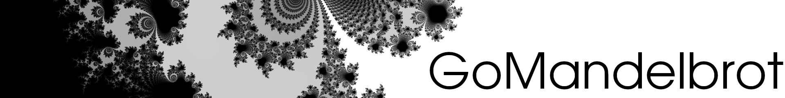
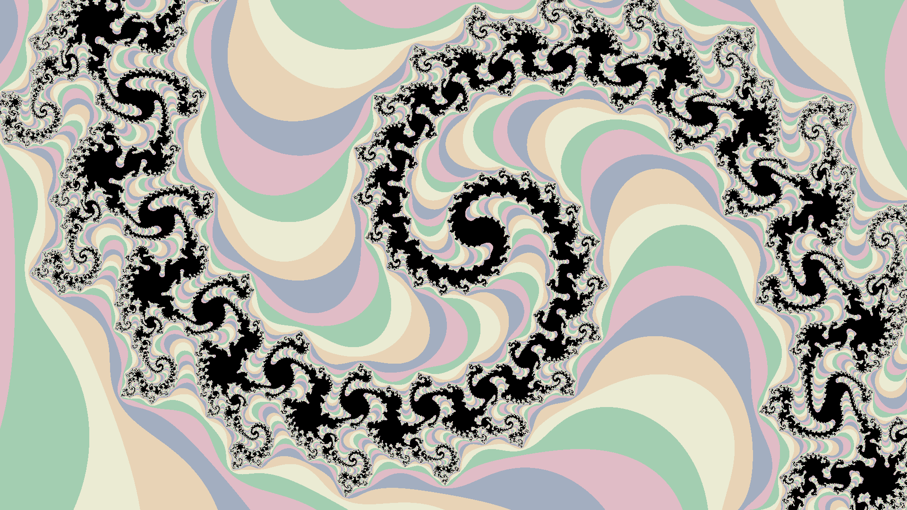

This is a practise exercise to learn Go. It draws the mandelbrot set.

### The math
The [mandelbrot set](https://en.wikipedia.org/wiki/Mandelbrot_set) is a mathematical object defined as the set of points `c` in complex space such that:
- Starting with `z = 0`
- Repeteadly applying the transformation `f: z → z*z + c`, the norm does not diverge to infinty.

It is known that if `|z| > 2`, then the value diverges, hence we can color the complex plane according to how many iterations it takes to reach `|z| = 2`. To be certain that a particular point does not diverge, we'd have to iterate at infinitum, hence an upper bound must be set. This upper bound controls the accuracy (higher is better) and computational expense (lower is cheaper).

In grayscale images, lighter colors represent faster divergence times (i.e. fewest iterations before exiting the threshold), and pure black represents that the maximum number of iterations has been reached. Colour pictures have two regions:
- The black region is the approximation of the Mandelbrot set (i.e. `niter >= maxiter`)
- Each colour other than black represents a value of `niter mod ncolors`.

Linear colormaps (such as the grayscale one here) are better at showing divergence period, whereas modular or repetitive colourmaps are better at showing the borders between regions.

### How to run
The first time you must build it:
```
make
```
Then, to run it, you do
```
./mandelbrot
```
You can use flag `-help` to see the tweakables. To see the whole mandelbrot set, use:
```
./mandelbrot -zc=-0.6 -zs=3.5 -o mandelbrot.ppm
```

### Image format
The image is outputted as a [NetPBM](https://en.wikipedia.org/wiki/Netpbm) image, with either format
- .ppm OR .bin.ppm
- .ascii.ppm

You can choose the format with `-o FILENAME.FORMAT`

You can convert them to png with:
```bash
pnmtopng FILENAME.FORMAT > mandelbrot.png
```

### Results
Here are a few images generated by this project. Go to [examples](examples/README.md) to see more examples, and details about them.





