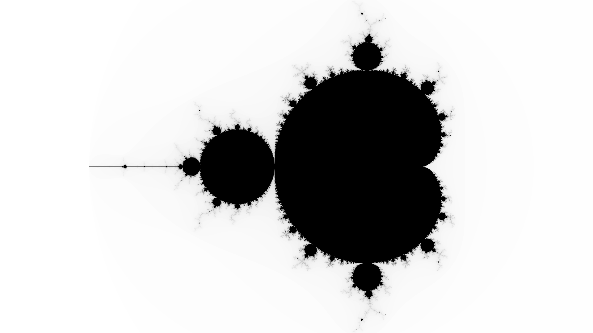

# Generation data

### Full
- Max iterations: 200
- Resolution: 1920 x 1080
- Subsampling level: 1
- Colormap: grayscale [0, 200]
- Complex plane center: -0.600000 +0.000000i
- Complex plane span:   4.000000 +2.250000i

### Spirals
- Max iterations: 200
- Resolution: 1920 x 1080
- Subsampling level: 1
- Colormap: grayscale [50, 200]
- Complex plane center: -0.803300 +0.178000i
- Complex plane span:   0.001700 +0.000956i

### Spirals (pastel)
Same as before, except for:
- Max iterations: 100
- Colormap: pastel [0, 100] nl=0

### Octopus
- Max iterations: 1500
- Resolution: 1920 x 1080
- Subsampling level: 1
- Colormap: grayscale [150, 1500] nl=100000
- Complex plane center: -0.802627 +0.1774515i
- Complex plane span:   2e-05 +1.125e-05i

### Octopus with sub-sampling
Same as before, but with:
- Subsampling level: 5

Acts as an antialiasing. Performance impact is O(n²), with n being the subsampling level.

### Copies
- Max iterations: 200
- Resolution: 1920 x 1080
- Subsampling level: 1
- Colormap: grayscale [0, 200]
- Complex plane center: -0.900000 +0.250000i
- Complex plane span:   0.187500 +0.105469i

### Copies (bright repetitive colormap)
Same as previous one, except:
- Max iterations: 50
- Subsampling level: 3
- Colormap: multicolor [0, 50] nl=0

### Copies (pastel repetitive colormap)
Same as previous one, except:
- Colormap: pastel [0, 50] nl=0

## Mini
- Max iterations: 400
- Resolution: 1920 x 1080
- Subsampling level: 1
- Colormap: grayscale [0, 400]
- Complex plane center: -1.256000 +0.382000i
- Complex plane span:   0.015000 +0.008438i

### Banner
- Max iterations: 5000
- Resolution: 1920 x 240
- Subsampling level: 3
- Colormap: grayscale [400, 5000] nl=100000
- Complex plane center: 0.35601+0.331i
- Complex plane span:   0.0001+1.25e-05i

